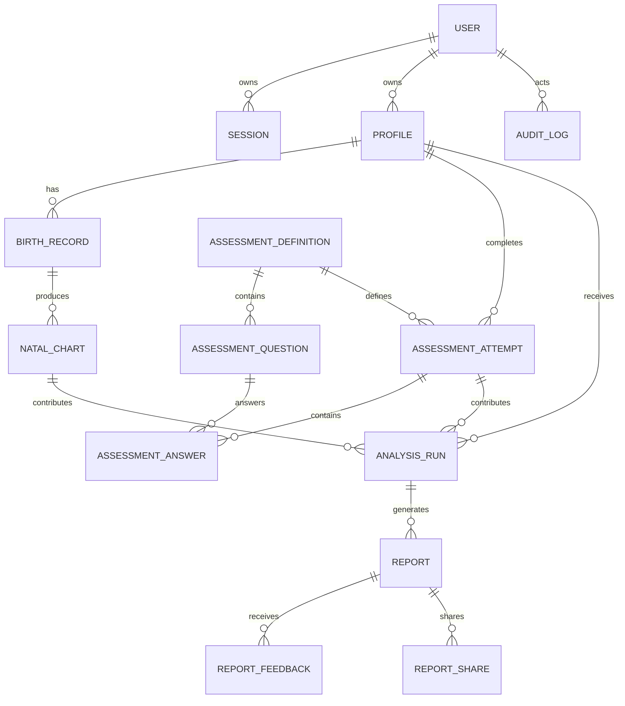

# WeekEasy MVP 数据模型设计

状态：Draft v0.1  
范围：邮箱验证码登录、个人档案、出生资料、八字排盘、Big Five、交叉分析、AI 报告、用户反馈和报告分享。

## 1. 设计原则

1. `User` 表示登录账户，`Profile` 表示被分析的人；一个账户可以拥有多个档案。
2. 出生资料是敏感数据，不写入日志，不发送给不需要它的外部服务。
3. 命盘由确定性代码生成，AI 只能读取标准化分析结果，不能修改命盘。
4. 命盘、测评结果、交叉分析和报告都保存版本化快照；重算生成新记录，不覆盖历史记录。
5. 需要筛选、关联、统计的数据使用普通列；复杂且主要用于回放的快照使用 `JSONB`。
6. 邮箱验证码、错误次数和短期限流保存在 Redis，不落 PostgreSQL。
7. BullMQ 保存任务运行状态；PostgreSQL 只保存业务状态和最终结果。

## 2. 核心实体关系

## 3. 账户与认证

### users

账户主体，不承担被分析对象的个人资料职责。

| 字段 | PostgreSQL 类型 | 说明 |
|---|---|---|
| id | uuid | 主键，应用层生成 UUID v7 |
| email | text | 规范化邮箱，小写并去除首尾空格 |
| email_verified_at | timestamptz nullable | 邮箱验证时间 |
| status | user_status | `ACTIVE`、`SUSPENDED`、`PENDING_DELETION` |
| locale | text | 默认 `zh-CN` |
| timezone | text | 用户当前 IANA 时区 |
| last_login_at | timestamptz nullable | 最后登录时间 |
| deletion_requested_at | timestamptz nullable | 申请注销时间 |
| created_at | timestamptz | 创建时间 |
| updated_at | timestamptz | 更新时间 |

约束与索引：

- `unique(lower(email))`
- `index(status, created_at)`
- 邮箱不能写入普通应用日志和错误追踪上下文。

### sessions

保存正式账户的刷新会话；访问令牌采用短期有效令牌。

| 字段 | PostgreSQL 类型 | 说明 |
|---|---|---|
| id | uuid | 主键 |
| user_id | uuid | 外键 `users.id` |
| token_hash | text | 刷新令牌哈希，不保存原文 |
| user_agent | text nullable | 设备描述，需截断长度 |
| ip_hash | text nullable | IP 的带密钥哈希，不保存长期明文 |
| expires_at | timestamptz | 到期时间 |
| revoked_at | timestamptz nullable | 主动撤销时间 |
| created_at | timestamptz | 创建时间 |

索引：

- `unique(token_hash)`
- `index(user_id, expires_at)`
- `index(expires_at)`，便于清理过期会话。

### 匿名游客

游客身份不创建伪造邮箱。使用带签名的匿名 Session 标识，服务端保存 `anonymous_id`。当用户完成邮箱验证后，在事务中将该游客拥有的档案迁移给正式用户。

第一版可以让 `profiles.owner_user_id` 暂时为空，并额外保存 `anonymous_id`；绑定完成后必须清空 `anonymous_id`。

## 4. 个人档案与出生资料

### profiles

表示被分析的人，与登录账户分离。

| 字段 | PostgreSQL 类型 | 说明 |
|---|---|---|
| id | uuid | 主键 |
| owner_user_id | uuid nullable | 正式账户所有者 |
| anonymous_id | uuid nullable | 游客所有者 |
| display_name | text | 昵称，不要求真实姓名 |
| relationship | profile_relationship | `SELF`、`PARTNER`、`FAMILY`、`FRIEND`、`OTHER` |
| gender | profile_gender | 命理规则所需值；允许 `UNSPECIFIED` |
| concern_topics | text[] | 当前关注主题代码 |
| consent_confirmed_at | timestamptz nullable | 为他人建档时的授权确认 |
| created_at | timestamptz | 创建时间 |
| updated_at | timestamptz | 更新时间 |
| deleted_at | timestamptz nullable | 软删除时间 |

约束：

- `owner_user_id` 与 `anonymous_id` 必须且只能有一个非空。
- `relationship != SELF` 时，正式生成报告前必须存在 `consent_confirmed_at`。
- `display_name` 不进入 AI 输入；AI 使用“用户”或“档案主体”等占位称谓。

索引：

- `index(owner_user_id, deleted_at)`
- `index(anonymous_id, deleted_at)`

### birth_records

保存一次出生资料输入。用户修改出生时间时创建新版本，不原地修改已产生报告的记录。

| 字段 | PostgreSQL 类型 | 说明 |
|---|---|---|
| id | uuid | 主键 |
| profile_id | uuid | 外键 `profiles.id` |
| revision | integer | 档案内递增版本 |
| calendar_type | calendar_type | `SOLAR` 或 `LUNAR` |
| precision | birth_time_precision | `MINUTE`、`HOUR`、`UNKNOWN_HOUR` |
| local_date | text | 用户输入的当地日期 `YYYY-MM-DD`，按历法类型解释；使用文本以支持农历二月三十 |
| is_leap_month | boolean | 农历输入是否为闰月；公历固定为 `false` |
| local_time | time nullable | 用户输入的当地时间 |
| timezone_id | text | IANA 时区，如 `Asia/Shanghai` |
| utc_offset_minutes | smallint | 计算时实际采用的 UTC 偏移快照 |
| country_code | char(2) nullable | ISO 国家代码 |
| region_name | text nullable | 省州级名称快照 |
| city_name | text nullable | 城市名称快照 |
| latitude | numeric(9,6) nullable | 纬度 |
| longitude | numeric(9,6) nullable | 经度 |
| use_true_solar_time | boolean | 是否启用真太阳时 |
| adjusted_local_datetime | timestamp nullable | 真太阳时修正后的当地时间 |
| day_boundary_rule | day_boundary_rule | 子时换日策略 |
| input_hash | text | 规范化输入的 HMAC，用于去重，不可反推 |
| created_at | timestamptz | 创建时间 |
| superseded_at | timestamptz nullable | 被新版本替代时间 |

约束与索引：

- `unique(profile_id, revision)`
- `index(profile_id, created_at desc)`
- `local_date`、`local_time`、地点与经纬度属于敏感字段；生产环境启用应用层字段加密时，可以收敛为加密载荷，同时保留不可逆 `input_hash`。
- 不允许对出生日期、人名或地点建立运营画像和广告标签。

## 5. 命盘与规则分析

### natal_charts

保存确定性排盘快照。记录创建后不可修改；引擎升级或规则配置变化时创建新记录。

| 字段 | PostgreSQL 类型 | 说明 |
|---|---|---|
| id | uuid | 主键 |
| profile_id | uuid | 冗余外键，便于按档案查询和权限校验 |
| birth_record_id | uuid | 输入版本 |
| engine_version | text | `bazi-core` 版本 |
| calendar_adapter | text | 历法适配器名称 |
| calendar_adapter_version | text | 历法库版本 |
| calculation_policy_version | text | 换日、真太阳时等策略版本 |
| status | chart_status | `CALCULATED`、`FAILED` |
| year_pillar | char(2) nullable | 年柱快照 |
| month_pillar | char(2) nullable | 月柱快照 |
| day_pillar | char(2) nullable | 日柱快照 |
| hour_pillar | char(2) nullable | 时柱；未知时辰时为空 |
| chart_data | jsonb | 完整标准化命盘 |
| warnings | jsonb | 边界、不确定性和校验警告 |
| calculation_hash | text | 输入与版本组合哈希 |
| calculated_at | timestamptz | 计算时间 |

约束与索引：

- `unique(calculation_hash)`
- `index(profile_id, calculated_at desc)`
- `index(birth_record_id, engine_version)`
- 不把藏干、十神等全部拆成关系表；首版没有跨用户统计需求，保存在 `chart_data` 更合适。

### analysis_runs

保存规则引擎和交叉分析的结果，是 AI 报告唯一允许使用的主要业务输入。

| 字段 | PostgreSQL 类型 | 说明 |
|---|---|---|
| id | uuid | 主键 |
| profile_id | uuid | 档案 |
| natal_chart_id | uuid | 命盘快照 |
| assessment_attempt_id | uuid nullable | 已完成的心理测评；纯命理报告时可空 |
| rule_set_code | text | 规则集代码 |
| rule_set_version | text | 规则集版本 |
| analysis_schema_version | text | 输出结构版本 |
| status | analysis_status | `COMPLETED`、`FAILED` |
| dimension_scores | jsonb | 标准化维度分数 |
| evidence | jsonb | 正向、反向证据与命中规则 |
| agreements | jsonb | 两种模型一致项 |
| conflicts | jsonb | 冲突项 |
| uncertainties | jsonb | 无法确定项 |
| data_completeness | numeric(4,3) | 0 到 1 |
| confidence | numeric(4,3) | 0 到 1 |
| input_hash | text | 所有输入和版本的哈希 |
| completed_at | timestamptz | 完成时间 |

约束与索引：

- `unique(input_hash)`
- `index(profile_id, completed_at desc)`
- `confidence` 和 `data_completeness` 必须在 0 到 1 之间。

首版规则定义保存在版本控制中的受控文件，不建立允许运营人员执行任意表达式的数据库规则表。后续如需规则后台，再增加 `rule_sets`、`rule_definitions` 和发布审批流程。

## 6. Big Five 测评

### assessment_definitions

| 字段 | PostgreSQL 类型 | 说明 |
|---|---|---|
| id | uuid | 主键 |
| code | text | 如 `BIG_FIVE_SHORT` |
| version | text | 问卷和计分规则版本 |
| title | text | 展示名称 |
| status | definition_status | `DRAFT`、`PUBLISHED`、`RETIRED` |
| scoring_config | jsonb | 维度、量表范围和有效性规则 |
| published_at | timestamptz nullable | 发布时间 |
| created_at | timestamptz | 创建时间 |

约束：`unique(code, version)`。

### assessment_questions

| 字段 | PostgreSQL 类型 | 说明 |
|---|---|---|
| id | uuid | 主键 |
| definition_id | uuid | 所属问卷版本 |
| code | text | 稳定问题代码 |
| position | integer | 展示顺序 |
| prompt | text | 问题正文 |
| dimension | text | 对应维度 |
| reverse_scored | boolean | 是否反向计分 |
| weight | numeric(6,3) | 题目权重，默认 1 |

约束：

- `unique(definition_id, code)`
- `unique(definition_id, position)`

### assessment_attempts

| 字段 | PostgreSQL 类型 | 说明 |
|---|---|---|
| id | uuid | 主键 |
| profile_id | uuid | 被测档案 |
| definition_id | uuid | 问卷版本 |
| status | attempt_status | `IN_PROGRESS`、`COMPLETED`、`ABANDONED`、`INVALID` |
| result_data | jsonb nullable | 完成后的计分快照 |
| validity_data | jsonb nullable | 用时、同值作答等质量信息 |
| started_at | timestamptz | 开始时间 |
| completed_at | timestamptz nullable | 完成时间 |

索引：`index(profile_id, completed_at desc)`。

### assessment_answers

| 字段 | PostgreSQL 类型 | 说明 |
|---|---|---|
| id | uuid | 主键 |
| attempt_id | uuid | 答卷 |
| question_id | uuid | 问题 |
| value | smallint | Likert 选项值 |
| answered_at | timestamptz | 作答时间 |

约束：`unique(attempt_id, question_id)`。

## 7. AI 报告、分享与反馈

### reports

报告是不可变内容快照。重新生成时创建新版本，并通过 `supersedes_report_id` 关联旧报告。

| 字段 | PostgreSQL 类型 | 说明 |
|---|---|---|
| id | uuid | 主键 |
| profile_id | uuid | 档案 |
| analysis_run_id | uuid | 结构化分析输入 |
| report_type | report_type | `PERSONALITY_CROSS_ANALYSIS` 等 |
| version | integer | 同一分析下的报告版本 |
| status | report_status | `QUEUED`、`GENERATING`、`COMPLETED`、`FAILED`、`ARCHIVED` |
| schema_version | text | 报告 JSON Schema 版本 |
| prompt_version | text | Prompt 版本 |
| provider | text nullable | AI 提供商 |
| model | text nullable | 模型名称 |
| content | jsonb nullable | 通过 Schema 校验后的正式报告 |
| safety_result | jsonb nullable | 安全审查结果 |
| usage_data | jsonb nullable | Token、耗时和重试次数；不保存密钥 |
| failure_code | text nullable | 可公开归类的失败代码 |
| failure_detail | text nullable | 已脱敏的错误摘要 |
| supersedes_report_id | uuid nullable | 被替代报告 |
| queued_at | timestamptz | 入队时间 |
| completed_at | timestamptz nullable | 完成时间 |
| created_at | timestamptz | 创建时间 |

约束与索引：

- `unique(analysis_run_id, report_type, version)`
- `index(profile_id, created_at desc)`
- `index(status, queued_at)`
- 状态为 `COMPLETED` 时 `content` 必须非空。
- 不默认保存发送给 AI 的完整原始 Prompt；保存 Prompt 模板版本和脱敏输入哈希即可。

### report_shares

| 字段 | PostgreSQL 类型 | 说明 |
|---|---|---|
| id | uuid | 主键 |
| report_id | uuid | 被分享报告 |
| token_hash | text | 分享令牌哈希，不保存令牌原文 |
| redaction_policy | jsonb | 分享时隐藏哪些字段 |
| expires_at | timestamptz nullable | 到期时间 |
| revoked_at | timestamptz nullable | 撤销时间 |
| created_at | timestamptz | 创建时间 |

约束与索引：

- `unique(token_hash)`
- `index(report_id, revoked_at)`
- 分享页不得显示出生日期、出生时间、精确地点、邮箱和内部证据规则代码。

### report_feedback

| 字段 | PostgreSQL 类型 | 说明 |
|---|---|---|
| id | uuid | 主键 |
| report_id | uuid | 报告 |
| user_id | uuid | 反馈用户 |
| section_key | text | 报告章节或维度代码 |
| rating | feedback_rating | `ACCURATE`、`PARTIAL`、`INACCURATE`、`UNKNOWN` |
| comment | text nullable | 用户补充，限制长度并执行内容过滤 |
| created_at | timestamptz | 创建时间 |
| updated_at | timestamptz | 更新时间 |

约束：`unique(report_id, user_id, section_key)`。

## 8. 通知与审计

### notification_deliveries

仅保存投递结果，不保存验证码正文。

| 字段 | PostgreSQL 类型 | 说明 |
|---|---|---|
| id | uuid | 主键 |
| user_id | uuid nullable | 已登录用户 |
| channel | notification_channel | 首版为 `EMAIL` |
| template_code | text | 如 `LOGIN_CODE`、`REPORT_READY` |
| recipient_hash | text | 收件人带密钥哈希 |
| provider | text | `MAILPIT`、`RESEND` 等 |
| provider_message_id | text nullable | 服务商消息 ID |
| status | delivery_status | `QUEUED`、`SENT`、`DELIVERED`、`BOUNCED`、`FAILED` |
| failure_code | text nullable | 失败分类 |
| created_at | timestamptz | 创建时间 |
| updated_at | timestamptz | 更新时间 |

索引：

- `index(user_id, created_at desc)`
- `index(status, created_at)`

### audit_logs

| 字段 | PostgreSQL 类型 | 说明 |
|---|---|---|
| id | uuid | 主键 |
| actor_user_id | uuid nullable | 操作者；系统任务可空 |
| actor_type | actor_type | `USER`、`ADMIN`、`SYSTEM` |
| action | text | 稳定动作代码 |
| resource_type | text | 资源类型 |
| resource_id | uuid nullable | 资源 ID |
| metadata | jsonb | 已脱敏元数据 |
| ip_hash | text nullable | 带密钥哈希 |
| created_at | timestamptz | 创建时间 |

索引：

- `index(actor_user_id, created_at desc)`
- `index(resource_type, resource_id, created_at desc)`
- 审计记录禁止保存出生资料、验证码、Session Token、AI Key 和报告正文。

## 9. 生命周期与删除策略

### 不可变记录

以下记录完成后原则上不更新正文，只更新状态或创建新版本：

- `natal_charts`
- 已完成的 `assessment_attempts`
- `analysis_runs`
- 已完成的 `reports`

### 档案删除

1. 将 `profiles.deleted_at` 标记为已删除，立即停止正常访问。
2. 撤销所有 `report_shares`。
3. 后台任务在冷静期结束后物理删除出生资料、命盘、答卷、分析、报告和反馈。
4. 审计记录保留事件本身，但匿名化用户和资源标识。

### 账户注销

1. `users.status` 变为 `PENDING_DELETION`。
2. 撤销全部 Session 和分享链接。
3. 冷静期结束后删除其所有档案和个人数据。
4. 保留法律或安全所需的最小匿名记录，不保留可恢复出生信息。

具体冷静期和保留期限在上线地区与隐私政策确定后配置，不硬编码在领域模型中。

## 10. 事务边界

以下操作必须处于数据库事务中：

1. 游客绑定正式账户，并迁移其档案所有权。
2. 创建出生资料新版本，并将旧版本标记为被替代。
3. 完成测评，同时保存答案、结果和完成状态。
4. 创建分析记录与报告任务业务记录。
5. 完成报告生成并写入最终内容和状态。
6. 创建或撤销分享链接。

外部邮件、AI 和队列调用不应放在长数据库事务内部。采用“先提交业务记录，再投递任务”的方式；后续可引入 Outbox Pattern 保证更高可靠性。

## 11. 暂不建立的表

MVP 不创建以下表，避免过早设计：

- 订单与支付
- 订阅与会员权益
- 每日记录与人生事件
- 双人合盘
- AI 长对话历史
- 社区内容
- 流年和每日运势
- 动态可执行规则

## 12. 待确认事项

在生成正式 Prisma Schema 前还需最终确认：

1. 用户是否可以在 MVP 创建他人档案；默认建议可以，但必须勾选已获授权。
2. 性别字段是否只服务于传统排盘规则，还是同时作为用户身份展示；默认建议仅用于规则，并允许不填写。
3. 出生时间不确定时，MVP 是直接生成三柱低置信度报告，还是要求用户选择一个时辰；默认建议支持三柱报告。
4. 游客能查看完整报告还是仅看预览；默认建议游客完成全部流程，但绑定邮箱后查看完整交叉报告。
5. 生产环境是否在 MVP 阶段就启用出生资料字段级加密；默认建议上线前启用，开发环境使用测试数据。
