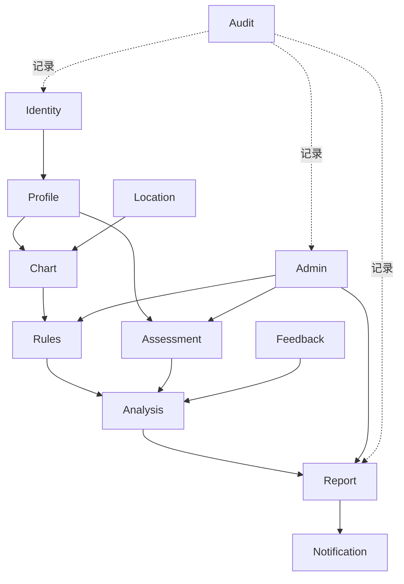

# 系统模块设计

## 1. 核心业务模块

### Identity

负责邮箱登录、Session、游客绑定、注销和数据导出入口。

### Profile

负责被分析对象的档案。`User` 是账户，`Profile` 是本人或获得授权的其他被分析对象。

### Location

负责地点搜索、经纬度、IANA 时区和历史时间信息，为排盘提供标准化输入。

### Chart

负责确定性排盘：

- 时间标准化；
- 真太阳时；
- 节气边界；
- 四柱、藏干、十神和五行；
- 刑冲合害；
- 计算版本和警告。

### Rules

负责将命盘转换为结构化信号：

- 规则命中；
- 维度分数；
- 正反证据；
- 冲突处理；
- 置信度。

### Assessment

负责 Big Five 问卷定义、答案、计分、结果和有效性。

### Analysis

负责比较命理维度与心理测评结果，输出一致项、冲突项、互补项和不确定项。

### Report

负责报告生命周期、AI任务、Schema 校验、内容安全、快照、版本和分享。

### Feedback

负责用户对报告章节和维度的准确度评价及文字补充。

## 2. 支撑模块

### Notification

负责邮箱验证码、报告完成通知、模板和投递状态。

### Admin

负责用户、报告、任务、规则版本、Prompt 版本和问卷定义的运营管理。

### Audit

记录用户敏感操作、管理员操作、报告重新生成和数据删除等事件。

## 3. 后续模块

首版不实现，仅保留业务规划：

- Subscription：会员权益；
- Billing：订单、支付和退款；
- Journal：每日记录和人生事件；
- Relationship：双人关系分析；
- AI Chat：连续对话顾问。

## 4. 模块关系

## 5. 关键边界

- Chart 不依赖 AI；
- Rules 不生成自然语言报告；
- Assessment 不依赖八字；
- Analysis 只接收标准化结果；
- Report 不修改分析证据；
- AI 不直接访问数据库；
- Admin 通过应用服务操作业务，不直接改表；
- 邮件、地图、AI 和存储均通过 Port/Adapter 接入。

